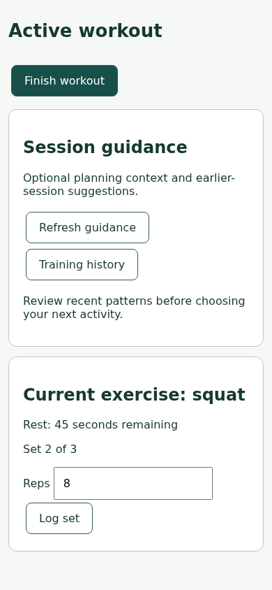
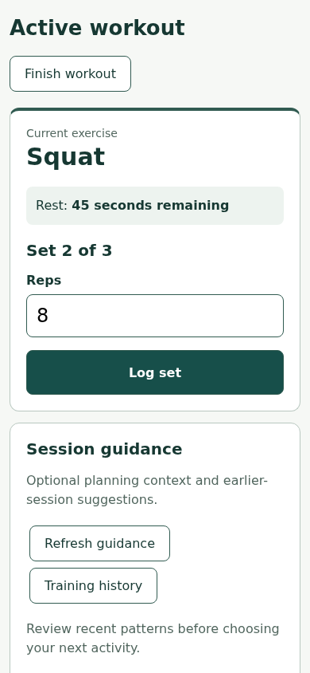

# Product experience: first focused pilot

Tested source: **712cbca3e315a1da2b2e59d19631ba4c5d545410**. Ten natural cases,
one execution per arm per case, `gpt-6-astra` / medium. This is development evidence
for the approved three-owner capability, not a release certification or a broad
comparison with Engineering Harness 0.5.1.

## Observed outcomes

All 20 executions completed. **Harness: 9 pass, 1 partial. Control: 9 pass, 1
partial.** No listed forbidden outcome was observed. The partial result in both
arms is `experience-accessible-name`: the correct `aria-label` was added and the
glyph preserved, but the executed test only checks the button ID. Neither arm
performed the required focused accessible-name check. A screenshot does not close
that evidence gap. We do not grade it as a complete pass or change the rubric.

| Case | Evidence and result, both arms unless noted |
| --- | --- |
| Today | Computed existing seven-day history inside Steps; eight cards and inline schedule retained; actual narrow render opened. |
| Photo review | Distinct loading/empty/failure meanings; refresh handler tested; loading/error renders opened; navigation preserved. |
| Meal retry | Manual edit/save remains available; retry handler and retained manual values checked; retry rendering opened. |
| Active workout | Current set/rest/logging gets priority; existing actions and finish confirmation retained; narrow/wide rendering inspected. |
| Brand | Identity, visual intent and voice proposal grounded in accepted intent and actual rendering; no production edits; implementation awaits approval. |
| No renderer | Source facts separated from visual hypotheses; no tool installation or production edits; visual conclusions left unverified. |
| Typo | Local label fix, no specialist fanout or scope/receipt documents. |
| Accessible name | Correct source edit; required semantic verification incomplete. |
| Component reuse | Existing component reused with unchanged text/contract; no new design machinery. |
| Fetch restraint | Zero preserved with nullish fallback; zero/null/undefined tested; no experience/assurance activation. |

The brand Harness trial naturally loaded `brand-and-language`, with three targeted
references and no Interface Design body. It explicitly separated human-response
hypotheses from observed visual mismatch. The source-only review loaded
`interface-design` and two targeted references. The other eight Harness trials
read the router without product-experience specialist bodies. Competing
`diagnosing-bugs` was observed twice in Harness and three times in control.

This demonstrates the two specialist discovery paths and substantial restraint.
It **does not demonstrate a failure caught uniquely by Harness**, reliable UX-owner
activation, superiority of the new skills, or broad usability improvement. The
accepted intent is unusually explicit in these small fixtures; Today, meal, photo,
and workout can be solved as bounded application of that intent. The UX owner
was not behaviorally exercised. Do not expand the campaign or owner set to conceal
that limitation. A future bounded real-task comparison should test an actually
unresolved flow/IA decision, after review of this pilot.

## Rendered examples

These are synthetic local fixtures, not VitalThread screenshots or live-user data.
The images show actual fixture rendering, not generated design mockups.

| Existing workout hierarchy | Authorized bounded correction |
| --- | --- |
|  |  |

[Current brand comparison rendering](brand-current.png),
[Harness brand proposal](brand-harness-proposal.md), and
[control brand proposal](brand-control-proposal.md) show identity work beyond copy
editing. Neither proposed redesign was implemented or rendered. Screenshots do not
prove human comprehension, accessibility conformance, or a working provider journey.

## Cost and context

| Same-cohort metric | Control | Harness | Delta |
| --- | ---: | ---: | ---: |
| Median trial wall time | 44.09 s | 51.13 s | +16.0% |
| Total input, including cache | 1,114,159 | 1,114,928 | +0.1% |
| Uncached input | 134,063 | 129,072 | −3.7% |
| Output | 8,760 | 10,607 | +21.1% |
| Model contexts | 10 | 10 | 0 |

No child contexts were used in either arm. These cases did not require independent
review; the package's own fresh source review is separate. File/read counts in
[assessments.json](assessments.json) are observations, not proof of causal token
attribution. Native-context reconciliation and retained-inventory validation passed
with the existing attribution tool. All contexts completed; no timeout or execution
failure occurred. This cohort is too small to establish stable cost estimates.
Competing skill selection differs, and fixture AGENTS.md encourages rendering even
for tiny edits. Consequently these numbers do not isolate the default minimal-path
cost or the cost of the new capabilities alone.

## Retention, isolation and checks

[receipt.json](receipt.json) binds the runtime/input/catalog hashes, source SHA,
retained trace inventory, public manifest, and per-arm metrics. Assessments retain
source/test diffs, fixture/artifact hashes, observed reads, and per-context usage.
Raw traces and complete records remain in the retained local campaign archive;
the PR does not publish private model reasoning. The inventory was pinned at
campaign completion and validates subsequent attribution reads, not an external
timestamp or cryptographic attestation of execution.

Fresh isolated homes installed the unmodified runtime through its marketplace.
Installed runtime hashes matched the candidate before and after execution, with no
manual corpus exclusions. The same competing catalog was copied into both arms;
no personal agent TOMLs were copied. Runtime-provided system skills and host skill
catalog declarations remained inherited and were recorded with observed file-tree
hashes. The observed host `diagnosing-bugs` body matched its pinned catalog copy.
Built-in agent/tool behavior remains tied to recorded CLI 0.153.4 rather than a
fully hermetic runtime image.

The pilot records equal-arm `sandbox_network_access: true` because Linux's
network-disabled sandbox blocks Chromium local IPC. Workspace write restrictions
remain; trial instructions prohibit external access and the renderer disables
DNS/proxy use. **This is not OS-enforced network isolation.** Browser version/hash
and a successful sandbox preflight are retained with the campaign environment.

The earlier `e81d046` attempt remains incomplete: six model executions completed,
14 queued jobs were cancelled without execution, and Chromium rendering was blocked.
It supplies no cohort score. The replacement snapshot adds deterministic Today
history and records the sandbox setting; it does not reuse the earlier outcomes.

On the tested source, 90 unit tests, package isolation validation, the official plugin
validator and all 13 skill validators pass. All 20 completed fixture check suites
also passed when independently rerun by the parent; this does not retroactively
supply the missing accessible-name check inside either trial. A fresh read-only
review found no source blocker; its delta review covered the evaluation correction.

No accessibility, real-user, mobile-native, complex navigation/recovery, or broad
three-owner effectiveness claim is established by this cohort. The focused evidence
gap and unexercised UX reasoning remain visible development limitations. No merge,
release, tag, publication, or installed-plugin update is part of this change.
